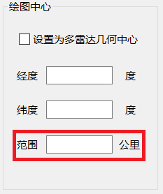
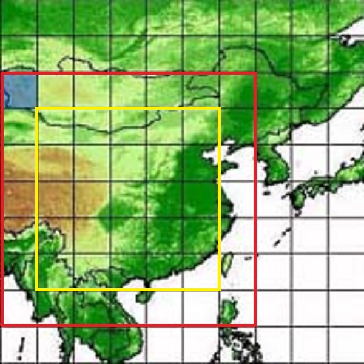

# SSR_COVERAGE_ANALYSER(二次雷达覆盖范围分析器)

## 运行环境

程序的运行环境需要`JRE9.0`及以上，包括对可运行的Jar文件中的`RADAR_COVERAGE_ANA.jar`和项目源码

## 系统资源

注意到`可运行的Jar文件`文件夹中，与`RADAR_COVERAGE_ANA.jar`同目录下有名为`src`的文件夹，其包含系统图标，属于系统资源，请务必将其和`RADAR_COVERAGE_ANA.jar`放在同目录下，才能保证`RADAR_COVERAGE_ANA.jar`的正常运行

## 使用说明

* 使用说明见项目演示视频

* (重要!)点击绘图按钮开始后，需要在软件空白处（可以是上方标题栏）单机一下或多下，之后鼠标变成等待按钮，等待一会会出现结果，如果长时间不出现结果，说明出现未知错误，需要及时关闭软件，重新打开后调整参数再次运行

* 选择绘图范围时，方框中填写的范围不要超过*600公里*，见下图

## 项目运行过程中需要导入的*SRTM*文件

* *SRTM*文件可以放在个人电脑中任何位置，但注意区域最好是连续的，即如果有一块地形文件，则它周围8块文件最好都要下载下来并放在同一个位置

* 在软件开发测试过程中选择的地形文件是`srtm_55_03.tif`至`srtm_61_09.tif`共`7X7=49`块方形地形文件，在使用过程中，最好将这些文件全部导入，这些区域如下图中红色方框包裹区域所示

## 项目源码地址

项目源码已全部上传至Github

<https://github.com/EthanTongLIU/RadarCoverageAnalyser>

